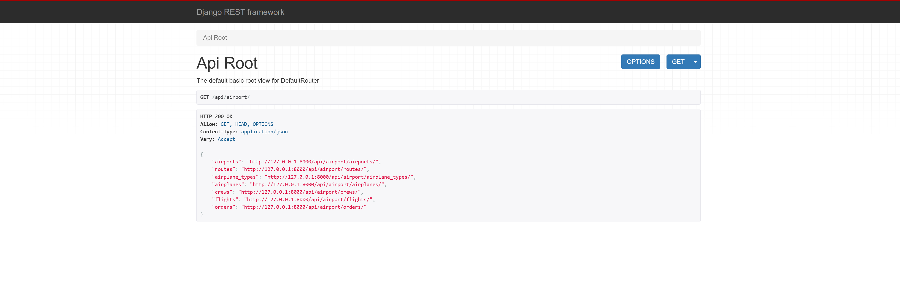

# **airport service**

## **Installing using GitHub**

Install PostgreSQL and create a database first.

```bash
git clone https://github.com/Oleksa-32/airport
cd airport
python -m venv venv
source venv/bin/activate
pip install -r requirements.txt

set DB_HOST=<your db hostname>
set DB_NAME=<your db name>
set DB_USER=<your db username>
set DB_PASSWORD=<your db user password>
set SECRET_KEY=<your secret key>

python manage.py migrate
python manage.py runserver
```

## Run with docker 

### Docker should be installed 

docker-compose build
docker-compose up

## Getting access 

Create a user via /api/user/register/
Get an access token via /api/user/token


## Features 

* JWT authentication
* Admin panel: /admin/
* Documentation at /api/doc/swagger/
* Manage orders and tickets
* Create airplanes, airports, airplane types
* Create routes, crew members
* Add flights

## DEMO


